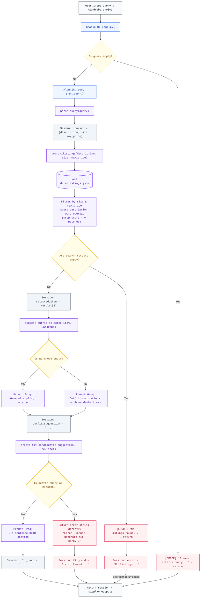

# FitFindr — planning.md

> Complete this document before writing any implementation code.
> Your spec and agent diagram are what you'll use to direct AI tools (Claude, Copilot, etc.) to generate your implementation — the more specific they are, the more useful the generated code will be.
> Your planning.md will be reviewed as part of your submission.
> Update it before starting any stretch features.

---

## Tools

List every tool your agent will use. For each tool, fill in all four fields.
You must have at least 3 tools. The three required tools are listed — add any additional tools below them.

### Tool 1: search_listings

**What it does:**
Searches through all the mock thrift listings and finds items that match what the user is looking for. It filters by keywords, size, and price.

**Input parameters:**
- `description` (str): Keywords describing what the user wants (e.g., "vintage graphic tee")
- `size` (str or None): An optional size filter (e.g., "M" or "S/M") — case-insensitive. If None, all sizes match.
- `max_price` (float or None): An optional price ceiling. If None, all prices match.

**What it returns:**
A list of matching listing dicts sorted by best match first. Each listing includes: id, title, description, category, style_tags, size, condition, price, colors, brand, and platform. Returns an empty list if nothing matches.

**What happens if it fails or returns nothing:**
If no listings match, return an empty list and the agent stops the interaction. It tells the user no items were found instead of trying to suggest outfits with nothing.

---

### Tool 2: suggest_outfit

**What it does:**
Takes a thrifted item the user found and their existing wardrobe, then uses the LLM to suggest 1–2 complete outfit combinations. If the wardrobe is empty, it gives general styling advice instead.

**Input parameters:**
- `new_item` (dict): The thrift listing the user is considering — includes title, description, colors, category, style_tags, etc.
- `wardrobe` (dict): The user's wardrobe with an 'items' key containing their existing clothes. May be empty.

**What it returns:**
A non-empty string with outfit suggestions. Describes specific pieces from the wardrobe (if available) paired with the new item, or general styling advice if the wardrobe is empty.

**What happens if it fails or returns nothing:**
If the wardrobe has no items, the tool still returns general styling ideas (for example, "This tee would pair well with..."). If the LLM response is empty, return a clear, friendly user-facing message. Example: "Sorry — I couldn't generate outfit ideas right now. Try again in a moment, or tell me a little more about your wardrobe (for example: 'blue jeans, white sneakers'). If this keeps happening, report code OUTFIT_GEN_01 and we'll take a look." Internally log the raw LLM output and the request parameters for debugging, but never expose raw traces to the user; always offer a next step (retry, add details, or contact support, etc..)

---

### Tool 3: create_fit_card

**What it does:**
Takes the outfit suggestion and the thrifted item details, then uses the LLM to generate a short, casual 2–4 sentence caption suitable for Instagram or TikTok. The caption naturally mentions the item name, price, and where it came from.

**Input parameters:**
- `outfit` (str): The outfit suggestion text from suggest_outfit.
- `new_item` (dict): The thrift listing with title, price, platform, colors, style_tags, etc.

**What it returns:**
A 2–4 sentence string that reads like a real OOTD post. It includes the item name, price, and platform once each, sounds casual and authentic, and captures the outfit vibe.

**What happens if it fails or returns nothing:**
If the outfit string is empty or missing, return an error message instead of crashing. Do not raise an exception.

---

### Additional Tools (if any)

### Tool 4: parse_query

**What it does:**
Takes the user's natural language query and extracts the structured search parameters. It pulls out the item description, optional size, and optional price ceiling from the text.

**Input parameters:**
- `query` (str): The user's natural language request (e.g., "I'm looking for a vintage graphic tee under $30, size M")

**What it returns:**
A dict with three keys:
- `description` (str): Keywords for what the user wants
- `size` (str or None): Size filter, or None if not mentioned
- `max_price` (float or None): Price ceiling, or None if not mentioned

**What happens if it fails or returns nothing:**
If the query is empty or too vague to extract anything useful, return a dict with empty description and None for size and price. The agent can then ask the user to clarify.

---

## Planning Loop

**How does your agent decide which tool to call next?**
1. Start with user query -> call parse_query to extract description, size, and max_price, store in session["parsed"]

2. Call search_listings with parsed parameters -> get back search_results, store in session["search_results"]

3. Check if search_results is empty:
   - **If yes:** Set session["error"] to "No listings match your search" and return the session early. Stop here.
   - **If no:** Pick the best result (first one), set session["selected_item"] = results[0], and proceed.

4. Call suggest_outfit with selected_item and wardrobe -> get back outfit suggestion string, store in session["outfit_suggestion"]

5. Call create_fit_card with outfit_suggestion and selected_item -> get back caption string, store in session["fit_card"]

6. Return the completed session with all results filled in.

**The agent only skips to the end if search_listings finds nothing.**

---

## State Management

**How does information from one tool get passed to the next?**
The agent keeps all interaction data in a single session dictionary. The session is created by `_new_session()` and starts with these keys:

- `query`: the original user text.
- `parsed`: empty at first, then filled with `description`, `size`, and `max_price` after `parse_query()` runs.
- `search_results`: starts empty, then stores the list returned by `search_listings()`.
- `selected_item`: starts as `None`, then holds the top listing chosen from `search_results`.
- `wardrobe`: the user's wardrobe dict, available throughout the interaction.
- `outfit_suggestion`: starts as `None`, then holds the string returned by `suggest_outfit()`.
- `fit_card`: starts as `None`, then holds the caption returned by `create_fit_card()`.
- `error`: starts as `None`, and is set if an early exit happens (for example, no matches were found).

The tools pass data between them like this:
- `parse_query()` turns the user query into structured parameters and stores them in `session["parsed"]`.
- `search_listings()` reads `session["parsed"]` and writes its results into `session["search_results"]`.
- The agent picks the best result from `session["search_results"]` and puts it in `session["selected_item"]`.
- `suggest_outfit()` uses `session["selected_item"]` and `session["wardrobe"]`, then stores its output in `session["outfit_suggestion"]`.
- `create_fit_card()` uses `session["outfit_suggestion"]` and `session["selected_item"]`, then stores its output in `session["fit_card"]`.

If `search_listings()` returns no results, the agent sets `session["error"]` and stops before calling the later tools.

---

## Error Handling

For each tool, describe the specific failure mode you're handling and what the agent does in response.

| Tool | Failure mode | Agent response |
|------|-------------|----------------|
| search_listings | No results match the query | The tool returns an empty list `[]`. The planning loop checks this, sets `session["error"]` with a suggestion statement, and returns the session early without running other tools. |
| search_listings | Corrupted listing dataset (e.g. invalid price type) | The tool skips the corrupted listing using a try-except block and continues matching and returning valid items. |
| suggest_outfit | Wardrobe is empty or missing | The tool handles this by prompting the LLM for general style advice and generic styling combinations. |
| suggest_outfit | Groq API call fails or returns empty response | The tool catches the exception, logs it, and returns a user-friendly error message with suggestion statement (error code `OUTFIT_GEN_01`). |
| create_fit_card | Outfit suggestion is missing or empty | The tool immediately returns an error string advising the user to get a valid outfit suggestion first. |
| create_fit_card | Groq API call fails | The tool catches the error and returns a friendly error message including a suggestion statement. |

### Concrete Examples from Testing

Here are specific testing scenarios from our test suite:
1. **Search Empty Results:** In `test_search_empty_results`, running a query for `designer ballgown size XXS under $5` yields `[]` without raising any exceptions, leading to a graceful early exit.
2. **Search Price Error:** In `test_search_listings_invalid_price`, we mocked a listing with a price of `"not-a-float"`. The tool successfully ignored this item and returned only valid items.
3. **Empty Wardrobe Styling:** In `test_suggest_outfit_empty_wardrobe`, when passing `{"items": []}`, the tool formats the prompt with "My wardrobe is currently empty" and successfully obtains general advice.
4. **Suggest API Error:** In `test_suggest_outfit_api_failure`, we mocked a Groq client exception. The tool returned the friendly string containing the support code `OUTFIT_GEN_01`.
5. **Fit Card Empty Outfit:** In `test_create_fit_card_empty_outfit`, passing an empty string returned the error string starting with `⛔️ Error: Cannot generate fit card...` instructing the user to try adjusting search keywords.
6. **Fit Card API Error:** In `test_create_fit_card_api_failure`, we simulated a Groq rate limit exception. The tool returned an error string starting with `❌ Error: Failed to generate fit card caption due to an API error...` suggesting checking network/API setup.

---

## Architecture
The actual diagram refers to the milestone2_archtecture.png in the root directory

---

## AI Tool Plan

**Milestone 3 — Individual tool implementations:**

**Tool 1 (parse_query):** I'll give Claude the Tool 4 spec from planning.md and ask it to implement the function using regex or string splitting to extract description, size, and price from the query. Before trusting it, I'll check that it handles queries with all three parameters, queries missing some parameters, and empty queries. Then I'll test it with 5 different query examples.

**Tool 2 (search_listings):** I'll give Claude the Tool 1 spec and ask it to implement the function using load_listings() from the data loader. Before running it, I'll verify that the generated code filters by all three parameters (description, size, max_price), handles case-insensitive size matching, and returns an empty list when nothing matches. Then I'll test it with 3 queries (one with results, one with no results, one with partial filters).

**Tool 3 (suggest_outfit):** I'll give Claude the Tool 2 spec and ask it to implement the function using the Groq LLM. I'll check that it calls the LLM with a well-formatted prompt, handles empty wardrobes by giving general styling advice, and always returns a non-empty string. Then I'll test it with both an empty wardrobe and a full wardrobe.

**Tool 4 (create_fit_card):** I'll give Claude the Tool 3 spec and ask it to implement the function using the Groq LLM with higher temperature for creativity. I'll verify that it guards against empty outfit strings, includes item name/price/platform naturally, and returns a 2–4 sentence caption. Then I'll test it with 2 different items to ensure the captions vary.

**Milestone 4 — Planning loop and state management:**

I'll give Claude the full planning.md file and ask it to implement run_agent() in agent.py following the planning loop exactly as described. I'll ask it to call parse_query first, then search_listings, then handle the empty-results case, then call suggest_outfit and create_fit_card in sequence. I'll verify that the session dict is initialized correctly, populated with results after each step, and returned at the end. Then I'll test run_agent with both a successful query and a no-results query to confirm the error handling works.

---

## A Complete Interaction (Step by Step)
FitFindr turns the user's question and wardrobe into a thrift item recommendation, a styling idea, and a short caption.

The tool order is:
- `parse_query` pulls out the item description, size, and price from the user's words.
- `search_listings` finds thrift items that match those filters.
- `suggest_outfit` uses the chosen item and the user's wardrobe to make styling suggestions.
- `create_fit_card` writes a short caption based on the outfit idea and item details.

Use a concrete example to show the full flow.

**Example user query:** "I'm looking for a vintage graphic tee under $30. I mostly wear baggy jeans and chunky sneakers. What's out there and how would I style it?"

**Step 1:**
The agent calls `parse_query(query)` to turn the text into `description`, `size`, and `max_price`. This makes the user's request easier for the next tool to use.

**Step 2:**
The agent calls `search_listings(description, size, max_price)` to find matching thrift items. We do this first because we need a real item before making outfit or caption suggestions.

**Step 3:**
If `search_listings` finds no items, the agent stops and tells the user nothing matched. If it finds items, the agent picks the best one and moves on.

**Step 4:**
The agent calls `suggest_outfit(selected_item, wardrobe)` so it can make the look feel personal. If the wardrobe has items, it suggests how to wear the thrift find with those pieces. If the wardrobe is empty, it gives general styling advice.

**Step 5:**
The agent calls `create_fit_card(outfit_suggestion, selected_item)` to make a short social caption. This is last because it needs the outfit idea and the item details.

**Final output to user:**
The user gets the top matching listing, a styling suggestion, and a short fit card caption.

---

## Spec Reflection

- **One way the spec helped:** Having clear inputs and return values in the specification helped write correct prompts for the LLM. It was easy to design prompt templates that only asked for the specific information needed by each tool without generating unnecessary conversational noise.
- **One divergence and why:** We added a helper tool called `parse_query` that extracts parameters from the user's natural language using regular expressions. This was a divergence because the original specification did not mandate how queries were parsed, but we implemented it as a separate tool to keep the matching logic in `search_listings` clean and decoupled from the natural language processing.

---

## AI Tool Use Reflection

### Instance 1: Generating the Query Parser Regex
- **What I directed the AI to do:** I directed the AI to write a Python function that uses regular expressions to extract a price limit (like "under $30") and a size (like "size M") from a text string, and then returns the remaining text as the product description.
- **What I reviewed, revised, or overrode:** I reviewed the AI-generated regex patterns and found that they failed when there were leading or trailing spaces, or when the user typed a size like "S/M" or "XXS". I revised the pattern to support a wider range of sizes (characters like `/` and `+`) and wrote a loop to clean up leading/trailing prepositions (like "looking for a") from the final product description.

### Instance 2: Creating Mock Tests for API Failure
- **What I directed the AI to do:** I asked the AI to write unit tests that verify how `suggest_outfit` and `create_fit_card` behave when the Groq client raises a network exception.
- **What I reviewed, revised, or overrode:** The generated test code tried to patch `groq.Groq` directly, which did not work because our tools instantiate the client through a helper function `_get_groq_client()`. I overrode the AI's approach by patching `tools._get_groq_client` instead to return a `MagicMock` client, which successfully raised the simulated exceptions. I also verified that the tool returned our specific fallback text instead of throwing unhandled errors.
